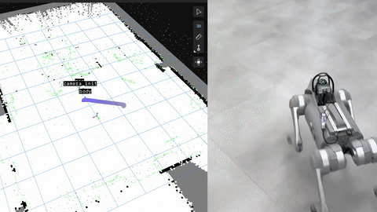
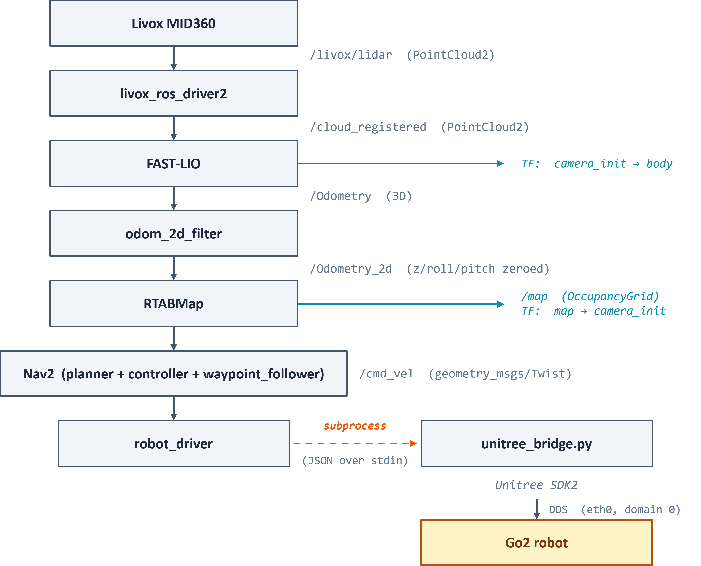

# Unitree Go2 Waypoint Navigation

Run SLAM and autonomous waypoint navigation for Unitree Go2, with Foxglove for interactive waypoint assignment. Everything runs inside a single Docker container.

[](https://docs.ros.org/en/humble)
[](https://releases.ubuntu.com/22.04/)
[](LICENSE)



*Left: RTABMap in Foxglove Studio. Right: Go2 navigating through clicked waypoints.*

---

## Why this project?

Most Go2 navigation projects assume a host ROS2 installed and use the official Unitree SDK with the build-in L1 LiDAR. This project takes a different approach:

- **Single Docker container** — The entire ROS2, SLAM, and Nav2 stack runs in one container on the Jetson Orin NX onboard. No host ROS2 installation needed.
- **External Livox MID360** — Used external Livox MID360 LiDAR for better SLAM quality in indoor environments.
- **Foxglove waypoint workflow** — Click waypoints on the live map in Foxglove Studio, then trigger the mission with a single ROS2 service call.
- **Clean DDS separation** — Unitree SDK's DDS context is isolated from ROS2's, which avoids the library version conflicts that often break this kind of integration.

If you're deploying Nav2 on Go2 with a custom sensor stack inside Docker, this project should help.


## Demo
*TBA* 


## System Architecture

<p align="center">
    
</p>

ROS2 and Unitree SDK each run their own DDS instance on separate domains and network interfaces. They're isolated via `cyclonedds_internal.xml`.


## Hardware Requirements

| Layer | Component |
|-----------|---------|
| OS | Ubuntu 22.04 (aarch64) |
| Container | Docker 20.10+ |
| Robot | Unitree Go2 |
| LiDAR | Livox MID360 |
| Compute | NVIDIA Jetson Orin NX (aarch64, Ubuntu 22.04) |
| Compute (client) | Raspberry Pi 5 |
| Audio | Speaker connected to Pi 5 |
| Networking | Tailscale installed on both Jetson & Raspberry Pi |

## Software Stack

| Role | Package |
|------|---------|
| LiDAR driver | [livox_ros_driver2](https://github.com/Livox-SDK/livox_ros_driver2) |
| LiDAR odometry | [FAST-LIO](https://github.com/hku-mars/FAST_LIO) |
| SLAM | [RTABMap](http://wiki.ros.org/rtabmap_ros) |
| Navigation | [Nav2](https://nav2.ros.org) |
| Robot control | Unitree SDK2 Python |
| Visualization | Foxglove Studio (port 8765) |
| Remote narration | ROSbridge Server + pyttsx3 (on Pi 5) |
| Networking | Tailscale |
| ROS2 | Humble (via `ros:humble-ros-base` Docker image) |

## Demo Zone & Keepout Filter

For live demonstrations, the robot can be constrained to a specific area using a three-layer safety system:

### 1. Physical Boundary
Retractable belt barriers or gaffer tape on the floor define the physical demo zone.

### 2. Nav2 Keepout Filter
A black-and-white mask image (`config/keepout_mask.pgm`) is loaded at launch. White areas are drivable; black areas are treated as walls by **both** the global and local costmaps.

To create your mask:
1. Open your saved `map.pgm` in GIMP
2. Create a new layer filled with pure black
3. Select your demo zone and fill with pure white
4. Export as `keepout_mask.pgm` (Raw format)
5. Ensure `config/keepout_mask.yaml` has the same `resolution` and `origin` as your `map.yaml`

### 3. Waypoint Bounds Checking
`waypoint_manager.py` rejects any waypoint clicked outside the configured `ZONE_MIN_X`, `ZONE_MAX_X`, `ZONE_MIN_Y`, `ZONE_MAX_Y` bounds, and announces the rejection via TTS.

### Foxglove Visualization
The demo zone is visualized in Foxglove's 3D panel as:
- A red rectangular boundary line
- A semi-transparent green fill inside the zone
- A "DEMO ZONE" text label

Configure the zone coordinates in `waypoint_manager.py`:
```python
self.ZONE_MIN_X = -2.0
self.ZONE_MAX_X =  2.0
self.ZONE_MIN_Y = -2.0
self.ZONE_MAX_Y =  2.0
````

## Speech Narration
The robot announces high-level mission states aloud through a speaker attached to a Raspberry Pi 5, providing clear audio feedback for users.

### Setup on Pi 5
```bash
sudo apt install python3-pip python3-pyttsx3 espeak-ng
pip3 install websocket-client
````

## Quick Start

### 1. Clone and build

```bash
git clone https://github.com/yehna-kim/unitree-go2-waypoint-nav.git
cd unitree-go2-waypoint-nav
docker build -t go2-slam .
```

The first build takes around 20 minutes (compiles Livox-SDK2, FAST-LIO, CycloneDDS, and Unitree Python SDK).

### 2. Build a map (Mapping mode)

```bash
./run_mapping.sh
```

In a separate terminal, open Foxglove Studio and connect to `ws://<jetson-ip>:8765`. You'll see the LiDAR cloud and the map being built in real time.

Drive the robot around the environment manually (using Go2's controller or app) until the map covers what you need. Press `Ctrl+C` to save and exit. The map is saved to `./map/rtabmap.db`.

### 3. Run autonomous navigation (Localization mode)

```bash
./run_localization.sh
```

In Foxglove Studio:

1. Connect to `ws://<jetson-ip>:8765`
2. Use the **Publish Pose** tool to click waypoints on the map (each click adds a numbered marker)
3. When the waypoints are set, trigger the mission from a terminal:

```bash
docker exec -it go2-slam bash -c "
    source /ros2_ws/install/setup.bash &&
    ros2 service call /start_mission std_srvs/srv/Trigger {}"
```

The robot navigates through the waypoints in order.

### Available services

| Service | Effect |
|---------|--------|
| `/start_mission` | Begin navigating through queued waypoints |
| `/undo_waypoint` | Remove the most recently added waypoint |
| `/clear_waypoints` | Clear all waypoints (also stops an in-progress mission) |

Call any service with `ros2 service call <name> std_srvs/srv/Trigger {}` from inside the container.


## Configuration

| File | What to tune |
|------|---------|
| `config/MID360_config.json` | LiDAR IP if not on the default subnet |
| `config/mid360.yaml` | FAST-LIO extrinsics, voxel filter size |
| `config/nav2_params.yaml` | Planner, controller, costmap, goal tolerances |
| `config/cyclonedds_internal.xml` | CycloneDDS loopback config (rarely needs editing) |

### Common tuning targets

**Robot oscillates along the path:**
```yaml
# config/nav2_params.yaml
controller_server:
  FollowPath:
    desired_linear_vel: 0.3        # Reduce from 0.5
    lookahead_dist: 1.5            # Increase from 1.2
```

**Robot stops too far from the goal:**
```yaml
general_goal_checker:
  xy_goal_tolerance: 0.2           # Reduce from 0.3
  yaw_goal_tolerance: 0.3          # Reduce from 0.5
```

**Robot moves too fast or too slow overall:**
```python
# ros2_ws/src/go2_slam_nodes/go2_slam_nodes/robot_driver.py
MAX_LINEAR_VEL  = 0.5    # Forward/backward speed (m/s)
MAX_LATERAL_VEL = 0.2    # Sideways speed (m/s)
MAX_YAW_VEL     = 0.8    # Rotation speed (rad/s)
```


## License

MIT — see [LICENSE](LICENSE)


## Acknowledgements

This project builds on:

- [FAST-LIO](https://github.com/hku-mars/FAST_LIO) by HKU MARS Lab
- [livox_ros_driver2](https://github.com/Livox-SDK/livox_ros_driver2) by Livox
- [RTABMap](https://github.com/introlab/rtabmap_ros) by IntRoLab
- [Nav2](https://github.com/ros-planning/navigation2) by the Open Navigation community
- [unitree_sdk2_python](https://github.com/unitreerobotics/unitree_sdk2_python) by Unitree Robotics
